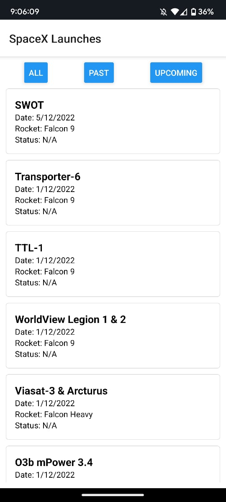
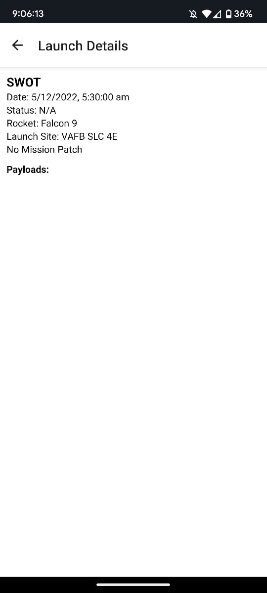

# SpaceX Launch Tracker

## Overview
This is a React Native app that fetches and displays information about SpaceX launches using the SpaceX API. Users can browse past and upcoming launches, view launch details, and filter launches based on status.

### Preview  
  
  


## Features
- Fetches and displays SpaceX launch data
- Filters launches (All, Past, Upcoming)
- Displays detailed information about each launch
- Fetches rocket, payload, and launchpad details
- Shows mission patches if available

## Installation
1. Clone the repository:
   ```sh
   git clone https://github.com/your-repo/spacex-launch-tracker.git
   cd spacex-launch-tracker
   ```
2. Install dependencies:
   ```sh
   npm install
   ```
3. Start the app:
   ```sh
   npx react-native run-android  # For Android
   npx react-native run-ios      # For iOS
   ```

## Dependencies
- React Native
- React Navigation

## API Used
- SpaceX API: [https://github.com/r-spacex/SpaceX-API](https://github.com/r-spacex/SpaceX-API)

## Project Structure
```
/spaceX-launch-tracker
│── App.js                # Main entry point
│── components/           # UI components (if any)
│── screens/              # Screen components
│── package.json          # Project dependencies
│── README.md             # Project documentation
```

## Screens
- **Launch List Screen:** Displays a list of SpaceX launches with filter options.
- **Launch Detail Screen:** Shows detailed information about a selected launch.

## License
This project is licensed under the MIT License.

